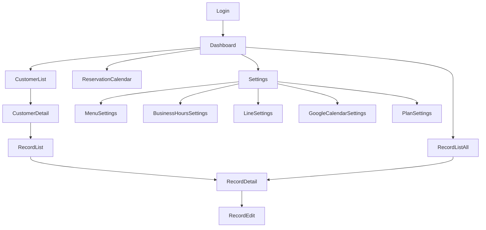

# Navigation

- RecordListAll（/records）はサイドバーの「カルテ」から遷移する。サロン全体のカルテを横断して閲覧・検索する画面で、カルテの新規作成・削除の導線は持たない（作成・削除は顧客コンテキストのある Customer Record List / Record Detail に置く）（[record/list-all.md](record/list-all.md)）
- ReservationCalendar（/reservations）はサイドバーの「予約」およびダッシュボードの「今日の予約」KPIカードから遷移する
- 予約の新規登録・編集はカレンダー内のダイアログで完結する（専用ルートは持たない）
- 公開予約ページ（/booking/:slug、/booking/cancel/:token）は認証外の独立導線のため上記の遷移図には含めない。サロンが外部（リッチメニュー・Instagram・Googleマップ等）に掲載したURLから直接アクセスされる（[public-booking.md](public-booking.md)）
- GoogleCalendarSettings（/settings/google-calendar）はGoogleの同意画面へ外部遷移し、API のコールバック経由で同ページへ戻る（`?connected=1` / `?error=`）。外部サイトを経由するが遷移先・復帰先はいずれも本ページのため、上記の遷移図では Settings からの1本のみで表す（[settings-google-calendar.md](settings-google-calendar.md)）
- PlanSettings（/settings/plan）はサイドバーの「設定」→「プラン・お支払い」カードから遷移する。Stripe Checkout・カスタマーポータルへ外部遷移し、`?checkout=success` / `?checkout=cancel` / `?checkout=portal` を付けて同ページへ戻る。外部サイトを経由するが遷移先・復帰先はいずれも本ページのため、上記の遷移図では Settings からの1本のみで表す（[settings-plan.md](settings-plan.md)）
- **サイドバーの項目は契約プランで変わる**（[ADR-029](../decisions/ADR-029-subscription-billing.md)）。「ダッシュボード」「設定」は常時表示し、「顧客」は customer、「カルテ」は medical_record、「予約」は reservation を含むプランでのみ表示する。Lite は ダッシュボード / 顧客 / カルテ / 設定 の4項目、Standard 以上でこれに 予約 が加わる
- `meta.feature` を持つルートへ契約プランに含まれない状態で入ると、ルータの `beforeEach` が FeatureLocked（/plan-required/:feature）へ振り替える。振り替え対象は 顧客・カルテ・予約カレンダー・メニュー管理（reservation）・LINE連携・Googleカレンダー連携。**これは案内のための振り替えであり、遮断そのものは API の 403 が担う**（[plan-required.md](plan-required.md)）
- PlanSettings は `meta.feature` を持たず、契約が切れて全機能が使えない状態でも到達できる。再契約の導線を塞がないための例外とする
