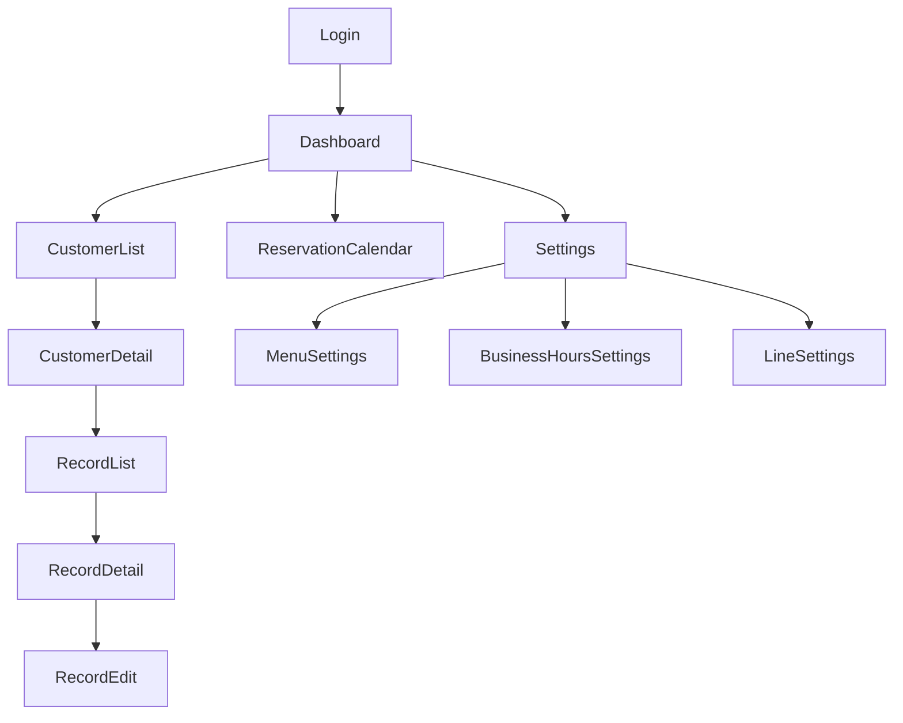

# Navigation

- ReservationCalendar（/reservations）はサイドバーの「予約」およびダッシュボードの「今日の予約」KPIカードから遷移する
- 予約の新規登録・編集はカレンダー内のダイアログで完結する（専用ルートは持たない）
- 公開予約ページ（/booking/:slug、/booking/cancel/:token）は認証外の独立導線のため上記の遷移図には含めない。サロンが外部（リッチメニュー・Instagram・Googleマップ等）に掲載したURLから直接アクセスされる（[public-booking.md](public-booking.md)）
