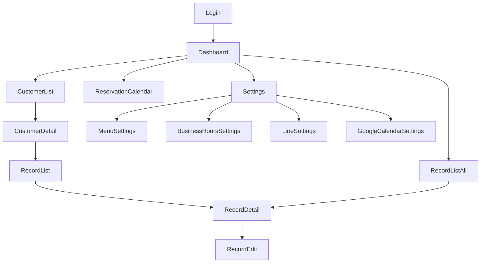

# Navigation

- RecordListAll（/records）はサイドバーの「カルテ」から遷移する。サロン全体のカルテを横断して閲覧・検索する画面で、カルテの新規作成・削除の導線は持たない（作成・削除は顧客コンテキストのある Customer Record List / Record Detail に置く）（[record/list-all.md](record/list-all.md)）
- ReservationCalendar（/reservations）はサイドバーの「予約」およびダッシュボードの「今日の予約」KPIカードから遷移する
- 予約の新規登録・編集はカレンダー内のダイアログで完結する（専用ルートは持たない）
- 公開予約ページ（/booking/:slug、/booking/cancel/:token）は認証外の独立導線のため上記の遷移図には含めない。サロンが外部（リッチメニュー・Instagram・Googleマップ等）に掲載したURLから直接アクセスされる（[public-booking.md](public-booking.md)）
- GoogleCalendarSettings（/settings/google-calendar）はGoogleの同意画面へ外部遷移し、API のコールバック経由で同ページへ戻る（`?connected=1` / `?error=`）。外部サイトを経由するが遷移先・復帰先はいずれも本ページのため、上記の遷移図では Settings からの1本のみで表す（[settings-google-calendar.md](settings-google-calendar.md)）
