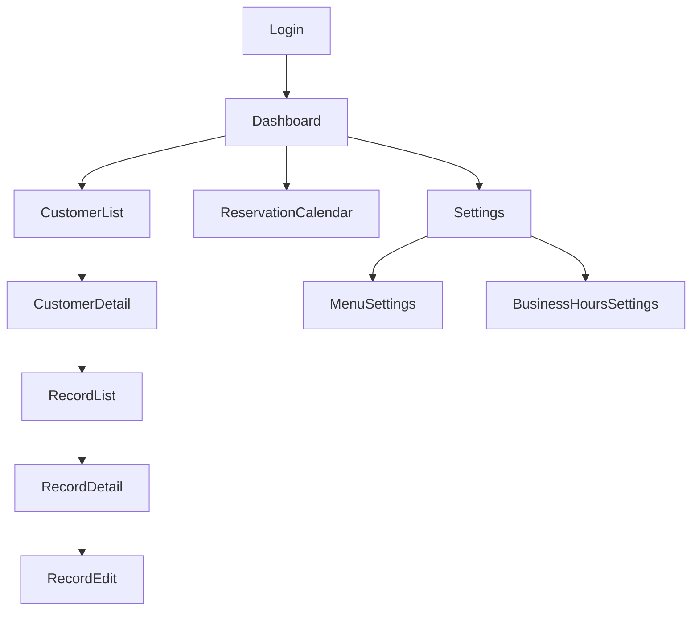

# Navigation

```mermaid
flowchart TD

Login --> Dashboard

Dashboard --> CustomerList

CustomerList --> CustomerDetail

CustomerDetail --> RecordList

RecordList --> RecordDetail

RecordDetail --> RecordEdit

Dashboard --> ReservationCalendar

Dashboard --> Settings

Settings --> MenuSettings

Settings --> BusinessHoursSettings
```

- ReservationCalendar（/reservations）はサイドバーの「予約」およびダッシュボードの「今日の予約」KPIカードから遷移する
- 予約の新規登録・編集はカレンダー内のダイアログで完結する（専用ルートは持たない）
